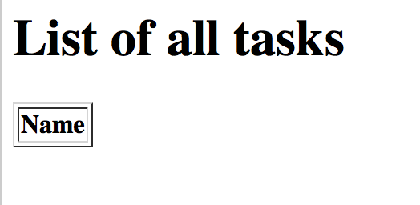

<h1 style="margin-top: -16px">Tutorial 3: Relish components</h1>

&lt; [Creating our tests](./tutorial-2.html) | ^ [Tutorial](./tutorial.html) | [Adding tasks](./tutorial-4.html) &gt;

What we *could* do at this point, is write a couple of methods that will use Selenide or Selenium code to automate the browser. And the code to launch the app and go to the task list page, then check that a table is empty probably won't be that long. But the trouble is that we are likely to interact with the same components and pages multiple times as we create more and more scenarios.

And that's where Relish helps. Relish allows you to quickly build testing components that represent the various elements of your UI, and allows you to interact with them in a simpler and more re-usable way.

## Launching the front page

Let's begin with the first step: 'Given I am on the task list'. We'll create a Relish *Page* class that represents the main page of our app:

    package com.example.components;
    
    import uk.co.blackpepper.relish.selenide.Page;
    
    public class TaskPage extends Page
    {
        public TaskPage()
        {
            super("/index.html");
        }
    }

This `TaskPage` is a testing facade that represents the front page of our application. Any kind of interaction we make with the `index.html` page, we'll make through this object. We'll need to construct a `TaskPage` object in our `SomeSteps.java` file, which we can then use in the 'Given I am on the task list' step:

    package com.example.steps;
    
    import com.example.components.TaskPage;
    
    import cucumber.api.java.en.Given;
    
    public class SomeSteps
    {
        private TaskPage taskPage = new TaskPage();
    
        @Given("^I am on the task list$")
        public void iAmOnTheTaskList()
        {
            taskPage.launch();
        }
    }

Because the `TaskPage` extends the Relish `Page` class, it automatically knows how to contact the web driver and launch the correct URL.

## Checking that the table is empty

Now we need to check that the table on the front page is empty. Again, we could just write some Selenide code in the step method in `SomeSteps`, but instead we will simply tell the `TaskPage` that it will contain a table for the tasks:

    package com.example.components;
    
    import org.openqa.selenium.By;
    
    import uk.co.blackpepper.relish.selenide.Table;
    import uk.co.blackpepper.relish.selenide.Page;
    
    public class TaskPage extends Page
    {
        public TaskPage()
        {
            super("/index.html");
        }
    
        public Table taskTable()
        {
            return new Table(By.className("tasks"), this);
        }
    }

The `taskTable()` method of the page returns a Relish object that represents the `Table` object that will be on the front screen. When we construct Relish web components, we need to provide two pieces of information:

Now that we have a `taskTable()` for our page, how do we use it? Let's add the implementation for our second step:

    package com.example.steps;
    
    import com.example.components.TaskPage;
    
    import cucumber.api.java.en.Given;
    import cucumber.api.java.en.Then;
    
    public class SomeSteps
    {
        private TaskPage taskPage = new TaskPage();
    
        @Given("^I am on the task list$")
        public void iAmOnTheTaskList()
        {
            taskPage.launch();
        }
    
        @Then("^the list of tasks will be empty$")
        public void theListOfTasksWillBeEmpty()
        {
            taskPage.taskTable().assertEmpty();
        }
    }

The `Table` object will look at the number of rows in the table that contain actual data (<td> cells) and checks that none are visible.

And that's it for our first scenario. Relish hides away a lot of the details of the low-level interaction with the browser. Most the application-specific test code we've written has been in the `TaskPage` class, defining the expected functional structure of the page. 

Now we've spent a few minutes creating this test, we can go an implement the initial web page.

&lt; [Creating our tests](./tutorial-2.html) | ^ [Tutorial](./tutorial.html) | [Adding tasks](./tutorial-4.html) &gt;
