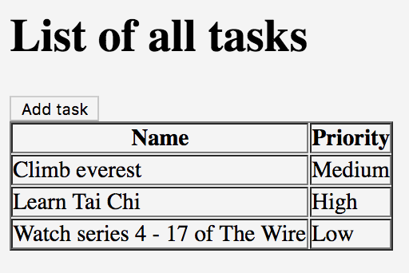

<h1 style="margin-top: -16px">Tutorial 5: Adding more fields</h1>

&lt; [Adding tasks](./tutorial-4.html) | ^ [Tutorial](./tutorial.html) | [Deleting tasks](./tutorial-6.html) &gt;

Now let's see what happens if there's a sudden change or requirements. Let's say that the customer suddenly decides that instead of just recording the *name* against each task, we also want to record a *priority* value of *High*, *Medium* or *Low*.

Let's look at what kind of impact that has on our tests. First, let's edit the feature file to include the new *Priority* field:

    Scenario: I can add a task
      Given I am on the task list
      When I choose to add these tasks
        | Name           | Priority |
        | Buy some bread | High     |
        | Buy some milk  | Low      |
      Then I will see this on the list of tasks
        | Name           | Priority |
        | Buy some bread | High     |
        | Buy some milk  | Low      |

What do we need to do to handle the new *Priority* value? We will begin by adding a new field to the `AddTaskPage` class:

    package com.example.components;
    
    import uk.co.blackpepper.relish.selenide.DropDown;
    import uk.co.blackpepper.relish.selenide.InputText;
    import uk.co.blackpepper.relish.selenide.Page;
    import uk.co.blackpepper.relish.selenide.SelenideWidget;
    import uk.co.blackpepper.relish.selenide.Table;
    import org.openqa.selenium.By;
    
    public class AddTaskPage extends Page {
        public AddTaskPage() {
            super("/add.html");
        }
    
        public InputText name() {
            return new InputText(By.id("name"), this);
        }
    
        public DropDown priority() {
            return new DropDown(By.id("priority"), this);
        }
    
        public SelenideWidget saveButton() {
            return new SelenideWidget(By.className("saveButton"), this);
        }
    }

The field we've added is a Relish `DropDown` widget, which is used to interact with HTML `<select/>` elements.

What else do we need to do? Well actually, **nothing**. Let's review the updated scenario:

    Scenario: I can add a task
      Given I am on the task list
      When I choose to add these tasks
        | Name           | Priority |
        | Buy some bread | High     |
        | Buy some milk  | Low      |
      Then I will see this on the list of tasks
        | Name           | Priority |
        | Buy some bread | High     |
        | Buy some milk  | Low      |

We already have a step to add tasks:

    @When("^I choose to add these tasks$")
    public void iChooseToAddTheseTasks(List<TableRow> tasks)
    {
        for(TableRow task : tasks)
        {
            taskPage.addButton().click();
            addTaskPage.set(task);
            addTaskPage.saveButton().click();
        }
    }

This code passes the contents of the feature table straight to the `AddTaskPage`. Relish will match the new *Priority* column with the `DropDown` widget returned from the `AddTaskPage.priority()` method, and pass it the *High*, *Medium* and *Low* values to it.

We've also already implemented the step to check the list of all tasks:

    @Then("^I will see this on the list of tasks$")
    public void iWillSeeThisOnTheListOfTasks(List<TableRow> tasks)
    {
        taskPage.taskTable().matches(tasks);
    }

This passes the feature table to the `Table` object, which will automatically checks that the new column appears in the table.

This demonstrates how Relish can help you not only create UI tests more quickly, but it can also greatly reduce the impact of changes to your tests.

&lt; [Adding tasks](./tutorial-4.html) | ^ [Tutorial](./tutorial.html) | [Deleting tasks](./tutorial-6.html) &gt;
