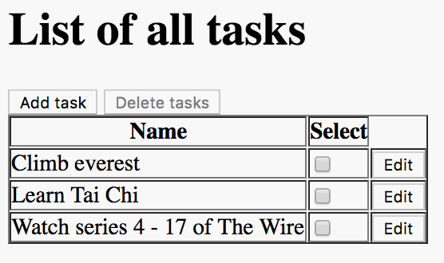

<h1 style="margin-top: -16px">Tutorial 6: Editing tasks</h1>

&lt; [Deleting tasks](./tutorial-5.html) | ^ [Tutorial](./tutorial.html)

Which brings us to the final scenario for this feature: editing tasks

    Scenario: Can edit a task
      Given I am on the task list
      When I choose to add these tasks
        | Name           |
        | Buy some bread |
        | Buy some milk  |
        | Buy some water |
      And I change the 'Buy some milk' task to
        | Name | Buy some cream |
      Then I will see this on the list of tasks
        | Name           |
        | Buy some bread |
        | Buy some cream |
        | Buy some water |

We'll need a new page for editing tasks. It will be virtually identical to to the `AddTaskPage`:

    package com.example.components;
    
    import org.openqa.selenium.By;
    
    import uk.co.blackpepper.relish.selenide.InputText;
    import uk.co.blackpepper.relish.selenide.Page;
    import uk.co.blackpepper.relish.selenide.SelenideWidget;
    
    public class EditTaskPage extends Page {
        public EditTaskPage() {
            super("/edit.html");
        }
    
        public InputText name() {
            return new InputText(By.id("name"), this);
        }
    
        public SelenideWidget saveButton() {
            return new SelenideWidget(By.className("saveButton"), this);
        }
    }

But this is the design for the "Edit" button on the front screen:

In this design, the column containing the "Edit" buttons does not have a heading. How do we refer to that column?

By default, a column without a heading if given a virtual heading that matches the number of the column, starting at zero. That means we can update the `taskTable()` to be aware of the "Edit" button like this:

    public Table taskTable()
    {
        return new Table(By.className("tasks"), this)
            .withCellComponent("select", (tdCell) -> new Checkbox(tdCell.$("input"), this))
            .withCellComponent("2", (tdCell) -> new SelenideWidget(tdCell.$("button"), this))
            ;
    }

The only step we need to implement for our "Edit" scenario is this one:

    And I change the 'Buy some milk' task to
    | Name | Buy some cream |

That means we need a way to access the edit button for the row with name `Buy some milk`. We can do that with a method on `Table` called `findFirst(...)`:

    taskPage.taskTable().findFirst("name", "Buy some milk")

This will return a Relish `HtmlRow` test component for the first row it finds with the correct name. The `HtmlRow` has a method called `getWidget(...)` which gives us access to the component for a single cell, either by passing a name, or a column number. That means we can click on the edit button for the `Buy some milk` row with this:

    taskPage.taskTable().findFirst("name", "Buy some milk").getWidget(2).click();

Adding this to a full implementation of the step, brings us to this version of the `SomeSteps.java` file:

    package com.example.steps;
    
    import com.example.components.AddTaskPage;
    import com.example.components.EditTaskPage;
    import com.example.components.TaskPage;
    
    import uk.co.blackpepper.relish.core.TableRow;
    
    import java.util.List;
    import java.util.stream.Collectors;
    
    import cucumber.api.Transpose;
    import cucumber.api.java.en.Given;
    import cucumber.api.java.en.Then;
    import cucumber.api.java.en.When;
    
    public class SomeSteps
    {
        private TaskPage taskPage = new TaskPage();
        private AddTaskPage addTaskPage = new AddTaskPage();
        private EditTaskPage editTaskPage = new EditTaskPage();
    
        @Given("^I am on the task list$")
        public void iAmOnTheTaskList()
        {
            taskPage.launch();
        }
    
        @Then("^the list of tasks will be empty$")
        public void theListOfTasksWillBeEmpty()
        {
            taskPage.taskTable().assertEmpty();
        }
    
        @When("^I choose to add these tasks$")
        public void iChooseToAddTheseTasks(List<TableRow> tasks)
        {
            for(TableRow task : tasks)
                {
                    taskPage.addButton().click();
                    addTaskPage.set(task);
                    addTaskPage.saveButton().click();
                }
        }
    
        @Then("^I will see this on the list of tasks$")
        public void iWillSeeThisOnTheListOfTasks(List<TableRow> tasks)
        {
            taskPage.taskTable().matches(tasks);
        }
    
        @When("^I will select these tasks$")
        public void iWillSelectTheseTasks(List<TableRow> tasks)
        {
            taskPage.taskTable().matches(tasks.stream().map(t -> t.except("select")).collect(Collectors.toList()));
            taskPage.taskTable().set(tasks.stream().map(t -> t.except("name")).collect(Collectors.toList()));
        }
    
        @When("^I choose to delete the selected tasks$")
        public void iChooseToDeleteTheSelectedTasks()
        {
            taskPage.deleteButton().click();
        }
    
        @Then("^the delete button is disabled$")
        public void theDeleteButtonIsDisabled()
        {
            taskPage.deleteButton().assertDisabled();
        }
    
        @When("^I change the '([^']*)' task to$")
        public void iChangeTheTaskTo(String name, @Transpose List<TableRow> task)
        {
            taskPage.taskTable().findFirst("name", name).getWidget(2).click();
            editTaskPage.set(task.get(0));
            editTaskPage.saveButton().click();
        }
    }

&lt; [Deleting tasks](./tutorial-5.html) | ^ [Tutorial](./tutorial.html)
