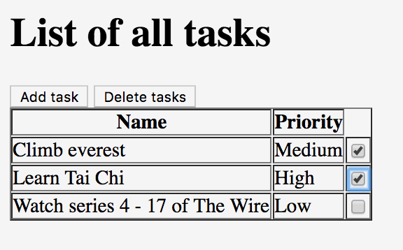

<h1 style="margin-top: -16px">Tutorial 6: Deleting tasks</h1>

&lt; [Adding more fields](./tutorial-5.html) | ^ [Tutorial](./tutorial.html) | [Editing tasks](./tutorial-7.html) &gt;

For our third scenario, we'll create a test that checks we can delete tasks. To do this, we'll allow the user to select a set of existing tasks, and then delete them:

    Scenario: Can delete tasks
      Given I am on the task list
      Then the delete button is disabled
      When I choose to add these tasks
        | Name           | Priority |
        | Buy some bread | High     |
        | Buy some milk  | Medium   |
        | Buy some water | Low      |
      And I will select these tasks
        | Name           | Priority | Select |
        | Buy some bread | High     | true   |
        | Buy some milk  | Medium   | false  |
        | Buy some water | Low      | true   |
      And I choose to delete the selected tasks
      Then I will see this on the list of tasks
        | Name          | Priority | Select |
        | Buy some milk | Medium   | false  |

## Add a delete button and checkboxes to the page

It should be obvious what the first thing we need to do is: add the components to the `TaskPage` object. We'll need a delete button:

    package com.example.components;
    
    import org.openqa.selenium.By;
    
    import uk.co.blackpepper.relish.selenide.Table;
    import uk.co.blackpepper.relish.selenide.Page;
    import uk.co.blackpepper.relish.selenide.SelenideWidget;
    
    public class TaskPage extends Page
    {
        public TaskPage()
        {
            super("/index.html");
        }
    
        public Table taskTable()
        {
            return new Table(By.className("tasks"), this);
        }
    
        public SelenideWidget addButton()
        {
            return new SelenideWidget(By.className("addButton"), this);
        }
    
        public SelenideWidget deleteButton()
        {
            return new SelenideWidget(By.className("deleteButton"), this);
        }
    }

But then there's something a little more complex that we need to do: to modify the `Table` object returned from `taskTable()` so that it has the ability to interact with the checkbox in the `Selected` column of each table row.

By default, each cell in a `Table` is a simple `SelenideWidget`. That means the table is able to look at the text inside the table-cell, but it can't treat it like a more complex component, like a checkbox.

To do that, we need to call the `withCellComponent(...)` method of the `Table` object. This allows us to construct a Relish component for any given column:

    package com.example.components;
    
    import org.openqa.selenium.By;
    
    import uk.co.blackpepper.relish.selenide.Checkbox;
    import uk.co.blackpepper.relish.selenide.Table;
    import uk.co.blackpepper.relish.selenide.Page;
    
    public class TaskPage extends Page
    {
        public TaskPage()
        {
            super("/index.html");
        }
    
        public Table taskTable()
        {
            return new Table(By.className("tasks"), this)
                .withCellComponent("select", (tdCell) -> new Checkbox(tdCell.$("input"), this))
                ;
        }
    
        public SelenideWidget addButton()
        {
            return new SelenideWidget(By.className("addButton"), this);
        }
    
        public SelenideWidget deleteButton()
        {
            return new SelenideWidget(By.className("deleteButton"), this);
        }
    }

The `.withCellComponent(...)` line will automatically a `Checkbox` testing for the checkbox `input` element inside the `select` column.

## Implement the "delete tasks" steps

Let's take another look at our new scenario:

    Scenario: Can delete tasks
      Given I am on the task list
      Then the delete button is disabled
      When I choose to add these tasks
        | Name           | Priority |
        | Buy some bread | High     |
        | Buy some milk  | Medium   |
        | Buy some water | Low      |
      And I will select these tasks
        | Name           | Priority | Select |
        | Buy some bread | High     | true   |
        | Buy some milk  | Medium   | false  |
        | Buy some water | Low      | true   |
      And I choose to delete the selected tasks
      Then I will see this on the list of tasks
        | Name          | Priority | Select |
        | Buy some milk | Medium   | false  |

We have already implemented a `Given I am on the task list` step. 

The code for the `Then the delete button is disabled` can call our new `deleteButton()` component:

    @Then("^the delete button is disabled$")
    public void theDeleteButtonIsDisabled()
    {
        taskPage.deleteButton().assertDisabled();
    }

The `assertDisabled()` method will check that the button is disabled.

We have already implemented the `When I choose to add these tasks` step.

But we will need to write new code for `And I will select these tasks`. This step will need to interact with the `Checkbox` objects we just added to the `taskTable()` object.

Our step will use this data from the feature file:

<table border="2" cellspacing="0" cellpadding="6" rules="groups" frame="hsides">

<colgroup>
<col  class="left" />

<col  class="left" />

<col  class="left" />
</colgroup>
<thead>
<tr>
<th scope="col" class="left">Name</th>
<th scope="col" class="left">Priority</th>
<th scope="col" class="left">Select</th>
</tr>
</thead>

<tbody>
<tr>
<td class="left">Buy some bread</td>
<td class="left">High</td>
<td class="left">true</td>
</tr>

<tr>
<td class="left">Buy some milk</td>
<td class="left">Medium</td>
<td class="left">false</td>
</tr>

<tr>
<td class="left">Buy some water</td>
<td class="left">Low</td>
<td class="left">true</td>
</tr>
</tbody>
</table>

There's something we need to think about before we implement this step: we need to update the checkboxes using the data in the `Select` column, but we **can't** update the data in the `Name` or `Priority` columns, because they contain static text:

So what we'll do instead is get the step to split the table into two tables that are like this:

<table border="2" cellspacing="0" cellpadding="6" rules="groups" frame="hsides">

<colgroup>
<col  class="left" />

<col  class="left" />
</colgroup>
<thead>
<tr>
<th scope="col" class="left">Name</th>
<th scope="col" class="left">Priority</th>
</tr>
</thead>

<tbody>
<tr>
<td class="left">Buy some bread</td>
<td class="left">High</td>
</tr>

<tr>
<td class="left">Buy some milk</td>
<td class="left">Medium</td>
</tr>

<tr>
<td class="left">Buy some water</td>
<td class="left">Low</td>
</tr>
</tbody>
</table>

and

<table border="2" cellspacing="0" cellpadding="6" rules="groups" frame="hsides">

<colgroup>
<col  class="left" />
</colgroup>
<thead>
<tr>
<th scope="col" class="left">Select</th>
</tr>
</thead>

<tbody>
<tr>
<td class="left">true</td>
</tr>

<tr>
<td class="left">false</td>
</tr>

<tr>
<td class="left">true</td>
</tr>
</tbody>
</table>

We'll use the data in the first table to check that the rows on the screen *match* the data in the table, then we'll use the data in the second table to *set* the checkboxes in the table.

How do we split the tables? Fortunately, the `TableRow` object has the ability to create new versions of itself, with some columns removed. For example, if a `TableRow` object called `row` has columns `height`, `weight`, `age` and `gender`, we can create a new `TableRow` object with `weight` and `gender` columns with `row.except("weight", "gender")`.

So if our origin feature table is called `tasks`, we can create a table just without the `Select` column with:

    tasks.stream().map(t -> t.except("select")).collect(Collectors.toList())

And a table without the `Name` and `Priority` columns with:

    tasks.stream().map(t -> t.except("name", "priority")).collect(Collectors.toList())

We can then pass these two tables (or, rather, these lists of `TableRows`) to the components like this:

    @When("^I will select these tasks$")
    public void iWillSelectTheseTasks(List<TableRow> tasks)
    {
        taskPage.taskTable().matches(tasks.stream().map(t -> t.except("select")).collect(Collectors.toList()));
        taskPage.taskTable().set(tasks.stream().map(t -> t.except("name", "priority")).collect(Collectors.toList()));
    }

That way our step will *check* that the `name` cells match the data in our feature file, and it will *set* the checkboxes according the `true` / `false` values given in the same table.

Finally, to implement the `And I choose to delete the selected tasks` step, we can simply call the `click()` method on the `tasksPage.deleteButton()` method.

That means our `SomeSteps.java` file currently looks like this:

    package com.example.steps;
    
    import com.example.components.AddTaskPage;
    import com.example.components.TaskPage;
    
    import uk.co.blackpepper.relish.core.TableRow;
    
    import java.util.ArrayList;
    import java.util.List;
    import java.util.stream.Collectors;
    
    import cucumber.api.java.en.Given;
    import cucumber.api.java.en.Then;
    import cucumber.api.java.en.When;
    
    public class SomeSteps
    {
        private TaskPage taskPage = new TaskPage();
        private AddTaskPage addTaskPage = new AddTaskPage();
    
        @Given("^I am on the task list$")
        public void iAmOnTheTaskList()
        {
            taskPage.launch();
        }
    
        @Then("^the list of tasks will be empty$")
        public void theListOfTasksWillBeEmpty()
        {
            taskPage.taskTable().assertEmpty();
        }
    
        @When("^I choose to add these tasks$")
        public void iChooseToAddTheseTasks(List<TableRow> tasks)
        {
            for(TableRow task : tasks)
            {
                taskPage.addButton().click();
                addTaskPage.set(task);
                addTaskPage.saveButton().click();
            }
        }
    
        @Then("^I will see this on the list of tasks$")
        public void iWillSeeThisOnTheListOfTasks(List<TableRow> tasks)
        {
            taskPage.taskTable().matches(tasks);
        }
    
        @When("^I will select these tasks$")
        public void iWillSelectTheseTasks(List<TableRow> tasks)
        {
            taskPage.taskTable().matches(tasks.stream().map(t -> t.except("select")).collect(Collectors.toList()));
            taskPage.taskTable().set(tasks.stream().map(t -> t.except("name", "priority")).collect(Collectors.toList()));
        }
    
        @When("^I choose to delete the selected tasks$")
        public void iChooseToDeleteTheSelectedTasks()
        {
            taskPage.deleteButton().click();
        }
    
        @Then("^the delete button is disabled$")
        public void theDeleteButtonIsDisabled()
        {
            taskPage.deleteButton().assertDisabled();
        }
    }

&lt; [Adding more fields](./tutorial-5.html) | ^ [Tutorial](./tutorial.html) | [Editing tasks](./tutorial-7.html) &gt;
