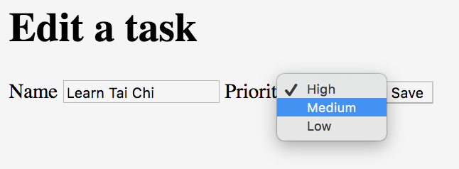

<h1 style="margin-top: -16px">Tutorial 8: Custom components</h1>

&lt; [Editing tasks](./tutorial-7.html) | ^ [Tutorial](./tutorial.html)

Web applications often share custom components between pages, and so it makes sense to create matching test components that can also be shared.

For example, consider the pages for adding and editing tasks:

The fields and the save button are exactly the same. The code that each of them runs may well be very different, but if the fields can be found in the same way (which would be the case if the implementation uses a custom component for the form) then we should be able to create our own custom component for interacting with the form:

    package com.example.components;
    
    import org.openqa.selenium.By;
    
    import uk.co.blackpepper.relish.core.Component;
    import uk.co.blackpepper.relish.selenide.DropDown;
    import uk.co.blackpepper.relish.selenide.InputText;
    import uk.co.blackpepper.relish.selenide.RadioButtons;
    import uk.co.blackpepper.relish.selenide.SelenideWidget;
    
    public class TaskForm extends SelenideWidget {
        public TaskForm(Component parent) {
            super(By.cssSelector("body"), parent);
        }
    
        public InputText name() {
            return new InputText(By.id("name"), this);
        }
    
        public DropDown priority() {
            return new DropDown(By.id("priority"), this);
        }
    
        public SelenideWidget saveButton() {
            return new SelenideWidget(By.className("saveButton"), this);
        }
    }

Our custom component extends `SelenideWidget`, and accepts a *parent* component in the constructor; this will be the Relish component that contains. In our case, this will be the `EditTaskPage` or the `AddTakePage`. If the form is always contained inside some element within the web page, we could has also included a selector for this in the constructor. Instead, we've kept it simple and told the super-class the form can be found somewhere within the `<body>` of the page.

Now we've created our form component, we can greatly simplify the `AddTaskPage` and `EditTaskPage` classes:

    package com.example.components;
    
    import uk.co.blackpepper.relish.selenide.Page;
    
    public class AddTaskPage extends Page {
        public AddTaskPage() {
            super("/add.html");
        }
    
        public TaskForm form() {
            return new TaskForm(this);
        }
    }

    package com.example.components;
    
    import uk.co.blackpepper.relish.selenide.Page;
    
    public class EditTaskPage extends Page {
        public EditTaskPage() {
            super("/edit.html");
        }
    
        public TaskForm form() {
            return new TaskForm(this);
        }
    }

Because we've changed the pages, we will need to make changes in `SomeSteps.java`, so that a call like:

    editTaskPage.set(task.get(0));

will become:

    editTaskPage.form().set(task.get(0));

So that `SomeSteps.java` will now be:

    package com.example.steps;
    
    import com.example.components.AddTaskPage;
    import com.example.components.EditTaskPage;
    import com.example.components.TaskPage;
    
    import uk.co.blackpepper.relish.core.TableRow;
    
    import java.util.List;
    import java.util.stream.Collectors;
    
    import cucumber.api.Transpose;
    import cucumber.api.java.en.Given;
    import cucumber.api.java.en.Then;
    import cucumber.api.java.en.When;
    
    public class SomeSteps
    {
        private TaskPage taskPage = new TaskPage();
        private AddTaskPage addTaskPage = new AddTaskPage();
        private EditTaskPage editTaskPage = new EditTaskPage();
    
        @Given("^I am on the task list$")
        public void iAmOnTheTaskList()
        {
            taskPage.launch();
        }
    
        @Then("^the list of tasks will be empty$")
        public void theListOfTasksWillBeEmpty()
        {
            taskPage.taskTable().assertEmpty();
        }
    
        @When("^I choose to add these tasks$")
        public void iChooseToAddTheseTasks(List<TableRow> tasks)
        {
            for(TableRow task : tasks)
                {
                    taskPage.addButton().click();
                    addTaskPage.form().set(task);
                    addTaskPage.form().saveButton().click();
                }
        }
    
        @Then("^I will see this on the list of tasks$")
        public void iWillSeeThisOnTheListOfTasks(List<TableRow> tasks)
        {
            taskPage.taskTable().matches(tasks);
        }
    
        @When("^I will select these tasks$")
        public void iWillSelectTheseTasks(List<TableRow> tasks)
        {
            taskPage.taskTable().matches(tasks.stream().map(t -> t.except("select")).collect(Collectors.toList()));
            taskPage.taskTable().set(tasks.stream().map(t -> t.except("name", "priority")).collect(Collectors.toList()));
        }
    
        @When("^I choose to delete the selected tasks$")
        public void iChooseToDeleteTheSelectedTasks()
        {
            taskPage.deleteButton().click();
        }
    
        @Then("^the delete button is disabled$")
        public void theDeleteButtonIsDisabled()
        {
            taskPage.deleteButton().assertDisabled();
        }

        @When("^I edit the '([^']*)' task$")
        public void iEditTheBuyTask(String name)
        {
            taskPage.taskTable().findFirst(row -> row.get("name").equals(name)).getWidget(4).click();
        }
    
        @Then("^the edit form will contain$")
        public void theEditFormWillContain(@Transpose List<TableRow> task)
        {
            editTaskPage.form().matches(task.get(0));
        }
    
        @When("^I save these changes$")
        public void iSaveTheseChanges(@Transpose List<TableRow> task)
        {
            editTaskPage.form().set(task.get(0));
            editTaskPage.form().saveButton().click();
        }
    }

Which means that if we now get another requirement, such as a new set of radio-buttons for *Task status*:

We just have to add a single method to the `TaskForm` component called `status()` which returns a Relish `RadioButtons` component:

    package com.example.components;
    
    import org.openqa.selenium.By;
    
    import uk.co.blackpepper.relish.core.Component;
    import uk.co.blackpepper.relish.selenide.DropDown;
    import uk.co.blackpepper.relish.selenide.InputText;
    import uk.co.blackpepper.relish.selenide.RadioButtons;
    import uk.co.blackpepper.relish.selenide.SelenideWidget;
    
    public class TaskForm extends SelenideWidget {
        public TaskForm(Component parent) {
            super(By.cssSelector("body"), parent);
        }
    
        public InputText name() {
            return new InputText(By.id("name"), this);
        }
    
        public DropDown priority() {
            return new DropDown(By.id("priority"), this);
        }
    
        public RadioButtons status() {
            return new RadioButtons(By.name("status"), this);
        }
    
        public SelenideWidget saveButton() {
            return new SelenideWidget(By.className("saveButton"), this);
        }
    }

And we can then update our feature file to add `status` values to be set and checked throughout:

    Feature: A list of tasks can be managed by the application
      As a user
      I want to be able to create, read, update and delete tasks
      So that I can manage my time
    
      Scenario: Initially the list of tasks is empty
        Given I am on the task list
        Then the list of tasks will be empty
    
      Scenario: I can add a task
        Given I am on the task list
        When I choose to add these tasks
          | Name           | Priority | Status  |
          | Buy some bread | H        | ready   |
          | Buy some milk  | L        | waiting |
        Then I will see this on the list of tasks
          | Name           | Priority | Status  |
          | Buy some bread | High     | Ready   |
          | Buy some milk  | Low      | Waiting |
    
      Scenario: Can delete tasks
        Given I am on the task list
        Then the delete button is disabled
        When I choose to add these tasks
          | Name           | Priority |
          | Buy some bread | H        |
          | Buy some milk  | M        |
          | Buy some water | L        |
        And I will select these tasks
          | Name           | Priority | Select |
          | Buy some bread | High     | true   |
          | Buy some milk  | Medium   | false  |
          | Buy some water | Low      | true   |
        And I choose to delete the selected tasks
        Then I will see this on the list of tasks
          | Name          | Priority | Select |
          | Buy some milk | Medium   | false  |
    
      Scenario: Can edit a task
        Given I am on the task list
        When I choose to add these tasks
          | Name           | Priority | Status  |
          | Buy some bread | M        | ready   |
          | Buy some milk  | L        | waiting |
          | Buy some water | H        | pending |
        And I change the 'Buy some milk' task to
          | Name     | Buy some cream |
          | Priority | M              |
          | Status   | done           |
        Then I will see this on the list of tasks
          | Name           | Priority | Status  |
          | Buy some bread | Medium   | Ready   |
          | Buy some cream | Medium   | Done    |
          | Buy some water | High     | Pending |

And other than changing this in `SomeSteps.java`:

    taskPage.taskTable().findFirst(row -> row.get("name").equals(name)).getWidget(3).click();

to

    taskPage.taskTable().findFirst(row -> row.get("name").equals(name)).getWidget(4).click();

and this in `TaskPage.java`:

    .withCellComponent("3", (tdCell) -> new SelenideWidget(tdCell.$("button"), this))

to

    .withCellComponent("4", (tdCell) -> new SelenideWidget(tdCell.$("button"), this))

(so that we can still click the `Edit` button, which is now in the fourth column) we're done.

&lt; [Editing tasks](./tutorial-7.html) | ^ [Tutorial](./tutorial.html)
