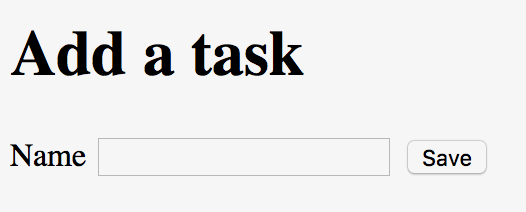

# Relish Tutorial

In this tutorial, we'll go through the steps required to create a Relish test suite for a simple task management application.

# Creating a project

For the details see [here](./creatingProject.html)

# Create our tests

We're going to create an application that will allow a user to create, read, update and delete tasks. Let's say this is our first user story:

> **Story 1: A list of tasks can be managed by the application**
> 
> As a user
> 
> I want to be able to create, read, update and delete tasks
> 
> So that I can manage my time

We'll create a new Cucumber `feature` file in the `src/resources/features/` folder called `0001-can-manage-list-of-tasks.feature`

    Feature: A list of tasks can be managed by the application
      As a user
      I want to be able to create, read, update and delete tasks
      So that I can manage my time

Now we'll add our first scenario&#x2013;a test that checks that when the app is first started, that there are no tasks recorded. When we write the application, we'll expect the main page to look something like this:

We can write a scenario to check that this is true:

    Feature: A list of tasks can be managed by the application
      As a user
      I want to be able to create, read, update and delete tasks
      So that I can manage my time
    
      Scenario: Initially the list of tasks is empty
        Given I am on the task list
        Then the list of tasks will be empty

This scenario contains two steps:

We'll need to write methods for each of these in the `SomeSteps.java` file that will automate the application for us.

And this is where Relish finally makes an appearance&#x2026;

# Introducing Relish components

What we *could* do at this point, is write a couple of methods that will use Selenide or Selenium code to automate the browser. And the code to launch the app and go to the task list page, then check that a table is empty probably won't be that long. But the trouble is that we are likely to interact with the same components and pages multiple times as we create more and more scenarios.

And that's where Relish helps. Relish allows you to quickly build testing components that represent the various elements of your UI, and allows you to interact with them in a simpler and more re-usable way.

## Launching the front page

Let's begin with the first step: 'Given I am on the task list'. We'll create a Relish *Page* class that represents the main page of our app:

    package com.example.components;
    
    import uk.co.blackpepper.relish.selenide.Page;
    
    public class TaskPage extends Page
    {
        public TaskPage()
        {
            super("/index.html");
        }
    }

This `TaskPage` is a testing facade that represents the front page of our application. Any kind of interaction we make with the `index.html` page, we'll make through this object. We'll need to construct a `TaskPage` object in our `SomeSteps.java` file, which we can then use in the 'Given I am on the task list' step:

    package com.example.steps;
    
    import com.example.components.TaskPage;
    
    import cucumber.api.java.en.Given;
    
    public class SomeSteps
    {
        private TaskPage taskPage = new TaskPage();
    
        @Given("^I am on the task list$")
        public void iAmOnTheTaskList()
        {
            taskPage.launch();
        }
    }

Because the `TaskPage` extends the Relish `Page` class, it automatically knows how to contact the web driver and launch the correct URL.

## Checking that the table is empty

Now we need to check that the table on the front page is empty. Again, we could just write some Selenide code in the step method in `SomeSteps`, but instead we will simply tell the `TaskPage` that it will contain a table for the tasks:

    package com.example.components;
    
    import org.openqa.selenium.By;
    
    import uk.co.blackpepper.relish.selenide.Table;
    import uk.co.blackpepper.relish.selenide.Page;
    
    public class TaskPage extends Page
    {
        public TaskPage()
        {
            super("/index.html");
        }
    
        public Table taskTable()
        {
            return new Table(By.className("tasks"), this);
        }
    }

The `taskTable()` method of the page returns a Relish object that represents the `Table` object that will be on the front screen. When we construct Relish web components, we need to provide two pieces of information:

Now that we have a `taskTable()` for our page, how do we use it? Let's add the implementation for our second step:

    package com.example.steps;
    
    import com.example.components.TaskPage;
    
    import cucumber.api.java.en.Given;
    import cucumber.api.java.en.Then;
    
    public class SomeSteps
    {
        private TaskPage taskPage = new TaskPage();
    
        @Given("^I am on the task list$")
        public void iAmOnTheTaskList()
        {
            taskPage.launch();
        }
    
        @Then("^the list of tasks will be empty$")
        public void theListOfTasksWillBeEmpty()
        {
            taskPage.taskTable().assertEmpty();
        }
    }

The `Table` object will look at the number of rows in the table that contain actual data (<td> cells) and checks that none are visible.

And that's it for our first scenario. Relish hides away a lot of the details of the low-level interaction with the browser. Most the application-specific test code we've written has been in the `TaskPage` class, defining the expected functional structure of the page. 

Now we've spent a few minutes creating this test, we can go an implement the initial web page.

# A second scenario: adding tasks

Our first scenario was obviously very simplistic. Now let's create a second, which requires a little more interactivity:

    Scenario: I can add a task
      Given I am on the task list
      When I choose to add these tasks
        | Name           |
        | Buy some bread |
        | Buy some milk  |
      Then I will see this on the list of tasks
        | Name           |
        | Buy some bread |
        | Buy some milk  |

Here we're using Cucumber feature-tables to specify the details of the tasks we going to add, and expect to the see on the application. Our scenario will begin by launching the app in the same way, but then will create a list of tasks, and check that they all appear on the front page as expected. 

We'll create each task with a second page containing a form that will allow us to enter the details of the task. When we save that task we'll return back to the front page of the application, where we should see our new task listed.

So we'll a button on the front page for adding a task:

And we'll need a second page with a simple form for entering a task, with a "Save" button:

When we click on the 'Add task' button on the front page, it will launch the 'Add task page', where we can fill out the details for the task, click 'Save' and return to the front page, where our new task will appear.

## Implementing the 'When I choose to add these tasks' step

We'll first modify our `TaskPage` class, adding in a testing component for the 'Add task' button:

    package com.example.components;
    
    import org.openqa.selenium.By;
    
    import uk.co.blackpepper.relish.selenide.Table;
    import uk.co.blackpepper.relish.selenide.Page;
    import uk.co.blackpepper.relish.selenide.SelenideWidget;
    
    public class TaskPage extends Page
    {
        public TaskPage()
        {
            super("/index.html");
        }
    
        public Table taskTable()
        {
            return new Table(By.className("tasks"), this);
        }
    
        public SelenideWidget addButton()
        {
            return new SelenideWidget(By.className("addButton"), this);
        }
    }

Our new `addButton()` method returns `SelenideWidget` Relish object. This is a generic component that represent some part of a web page that we can look at and click. 

We'll also need to create a class for our second page: the one for creating a new task. We'll this `AddTaskPage`:

    package com.example.components;
    
    import uk.co.blackpepper.relish.selenide.InputText;
    import uk.co.blackpepper.relish.selenide.Page;
    import uk.co.blackpepper.relish.selenide.SelenideWidget;
    import uk.co.blackpepper.relish.selenide.Table;
    import org.openqa.selenium.By;
    
    public class AddTaskPage extends Page {
        public AddTaskPage() {
            super("/add.html");
        }
    
        public InputText name() {
            return new InputText(By.id("name"), this);
        }
    
        public SelenideWidget saveButton() {
            return new SelenideWidget(By.className("saveButton"), this);
        }
    }

This class will be used to interact with the 'Add task page', which it will expect to find at path `/add.html`. It will include a button with the class name "saveButton" (which we represent by a `SelenideWidget` object), and also an `InputText` component with id "name". `InputText` is another Relish component for interacting with text fields.

Now we that have our page objects structured in the way that we want, we now need to write a 'When I choose to add these tasks' step. Remember: this is what the step looks like in our scenario:

    When I choose to add these tasks
      | Name           |
      | Buy some bread |
      | Buy some milk  |

This step will need to be passed the contents of the data-table containing the details of our new tasks. We normally do this in a Relish test by specifying the table as a list of Relish `TableRow` objects:

    @When("^I choose to add these tasks$")
    public void iChooseToAddTheseTasks(List<TableRow> tasks)
    {
    ....
    }

A `TableRow` is very similar to a `Map<String,String>` and it's designed specifically to interact with Relish components. You'll see how shortly.

Now that we've begun to create our step, we'll need to fill out the code. We'll loop through each of the `TableRow` objects from the table, and for each one:

This is how this is done in Relish:

    @When("^I choose to add these tasks$")
    public void iChooseToAddTheseTasks(List<TableRow> tasks)
    {
        for(TableRow task : tasks)
        {
            taskPage.addButton().click();
            addTaskPage.set(task);
            addTaskPage.saveButton().click();
        }
    }

Notice that we're assuming here we've created a `addTaskPage` object higher up in the class.

The `addButton()` and `saveButton()` components (like all `selenide-relish` widgets) have `click()` methods. The interesting line is `addTaskPage.set(task)`.

The `set()` method accepts a `TableRow` object and uses it to update all of the sub-components whose names match the columns in the `TableRow`. So because our table looks like this:

<table border="2" cellspacing="0" cellpadding="6" rules="groups" frame="hsides">

<colgroup>
<col  class="left" />
</colgroup>
<thead>
<tr>
<th scope="col" class="left">Name</th>
</tr>
</thead>

<tbody>
<tr>
<td class="left">Buy some bread</td>
</tr>

<tr>
<td class="left">Buy some milk</td>
</tr>
</tbody>
</table>

The `set()` method will convert the (only) column "Name" into camel-case, and look for a `name()` method on the `AddTaskPage` object. In our case, this `name()` method returns an `InputText` field, and Relish will tell the the `InputText` component to type in the strings "Buy some bread" and "Buy some milk" on each of the occasions that it visits the page.

If there had been multiple columns in the feature table, Relish would have looked for a matching component for each of them, and entered the data into each of the fields in the form.

This is where we start to benefit from the testing components built in to Relish: a lot of the boring "glue" code that takes data from a Cucumber scenario and passes it through to Selenide is done for us.

## Implementing the 'Then I will see this on the list of tasks' step

Now we need to check that the tasks we entered in the previous step now appear on the list of tasks on the main screen:

    Then I will see this on the list of tasks
      | Name           |
      | Buy some bread |
      | Buy some milk  |

This is actually remarkably easy to implement, because we already have all the components in place in the `Page` objects:

    @Then("^I will see this on the list of tasks$")
    public void iWillSeeThisOnTheListOfTasks(List<TableRow> tasks)
    {
        taskPage.taskTable().matches(tasks);
    }

This uses the `matches()` method of the `taskTable()` to assert that the table contains rows that match the detail of each `TableRow`. The `Table` object will handle all of the details of finding the column headings and matching them to the column names in the table. 

That completes the scenario. This is the current state of our `SomeSteps` class:

    package com.example.steps;
    
    import com.example.components.AddTaskPage;
    import com.example.components.TaskPage;
    
    import uk.co.blackpepper.relish.core.TableRow;
    
    import java.util.List;
    
    import cucumber.api.java.en.Given;
    import cucumber.api.java.en.Then;
    import cucumber.api.java.en.When;
    
    public class SomeSteps
    {
        private TaskPage taskPage = new TaskPage();
        private AddTaskPage addTaskPage = new AddTaskPage();
    
        @Given("^I am on the task list$")
        public void iAmOnTheTaskList()
        {
            taskPage.launch();
        }
    
        @Then("^the list of tasks will be empty$")
        public void theListOfTasksWillBeEmpty()
        {
            taskPage.taskTable().assertEmpty();
        }
    
        @When("^I choose to add these tasks$")
        public void iChooseToAddTheseTasks(List<TableRow> tasks)
        {
            for(TableRow task : tasks)
            {
                taskPage.addButton().click();
                addTaskPage.set(task);
                addTaskPage.saveButton().click();
            }
        }
    
        @Then("^I will see this on the list of tasks$")
        public void iWillSeeThisOnTheListOfTasks(List<TableRow> tasks)
        {
            taskPage.taskTable().matches(tasks);
        }
    }
