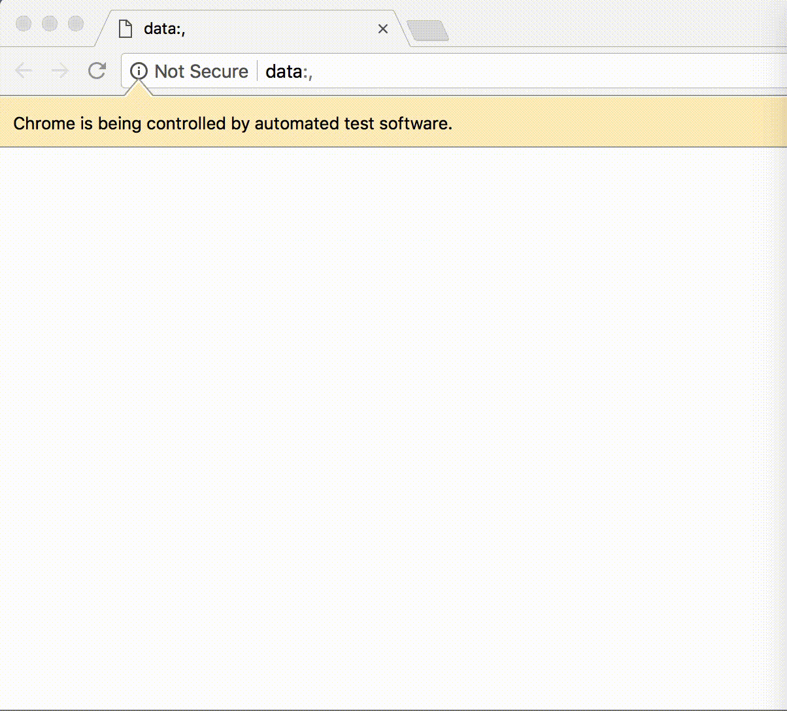

<h1 style="margin-top: -16px">Relish Tutorial</h1>

In this tutorial, we'll go through the steps required to create a Relish test suite for a simple task management application.

You can find the completed code in the [example-selenide](https://github.com/dogriffiths/relish/tree/master/examples/selenide/example-selenide) folder of the repo. When completed, the tutorial will run this sequence of automated tests:

1. [Creating the project](./tutorial-1.html)
A walkthrough of creating the tasks tutorial testing project.

2. [Create our tests](./tutorial-2.html)
Create a feature file for a user story.

3. [Relish components](./tutorial-3.html)
Starting our first proper scenario using Relish components.

4. [Adding tasks](./tutorial-4.html)
Sending data to a form and asserting the contents of a table.

5. [Adding more fields](./tutorial-5.html)
How Relish deals with the impact of changing the data model.

6. [Deleting tasks](./tutorial-6.html)
Adding interactive components to a table, and working with `TableRow` objects.

7. [Editing tasks](./tutorial-7.html)
Handling table columns without headings and filtering rows.

7. [Custom components](./tutorial-8.html)
If you re-use components in your, you should consider re-using components in your tests.
